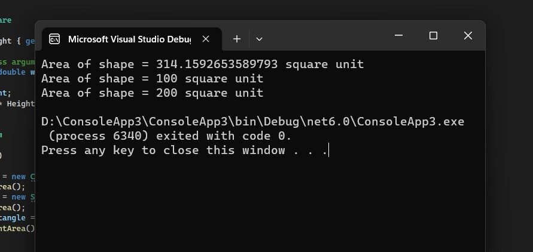
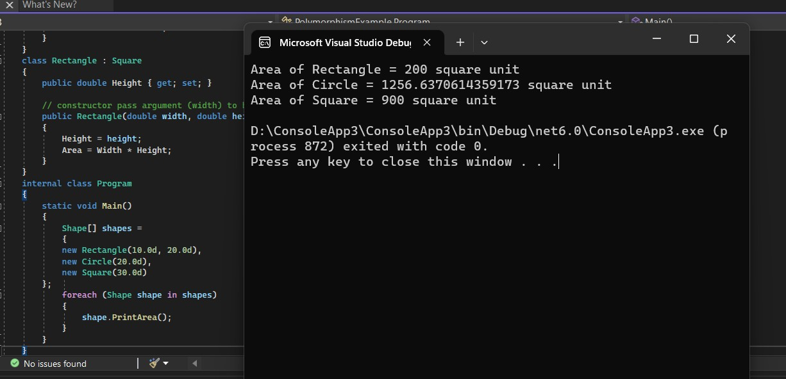

# 11.3 Abstract member

```cs
namespace PolymorphismExample
{
    abstract class Shape
    { 
        public double Area { get; set; }
        public void PrintArea()
        {
            Console.WriteLine($"Area of shape = {Area} square unit");
        }
    }
    class Circle : Shape
    {
        public double Raduis { get; set; }
        public Circle(double radius) 
        {
            Raduis = radius;
            Area = Math.PI * Raduis* Raduis;
        }
    }
    class Square : Shape
    { 
        public double Width { get; set; }
        public Square(double width)
        {
            Width = width;
            Area = Width * Width;
        }
    }
    class Rectangle : Square 
    {
        public double Height { get; set; }

        // constructor pass argument (width) to base class (square)  
        public Rectangle(double width, double height) : base(width)
        {
            Height = height;
            Area = Width * Height;
        }
    }
    internal class Program
    {
        static void Main()
        {
            Circle circle = new Circle(10.0d) ;
            circle.PrintArea();
            Square square = new Square(10.0d);
            square.PrintArea();
            Rectangle rectangle = new Rectangle(10.0d, 20.0d);
            rectangle.PrintArea();
        }
    }
}
```
ผลการรันโปรแกรม



## แก่ไขโปรแกรมด้านบนให้เป็นดังนี้

1. แก้ไขคลาส Shape
```cs
abstract class Shape
{ 
    public double Area { get; set; }
    public void PrintArea()
    {
        Console.WriteLine($"Area of {this.GetType().Name} = {Area} square unit");
    }
}
```

2. แก่ไขคลาส Program 

```cs
internal class Program
{
    static void Main()
    {
        Shape[] shapes =
        {
            new Rectangle(10.0d, 20.0d),
            new Circle(20.0d),
            new Square(30.0d)
        };
        foreach (Shape shape in shapes)
        {
            shape.PrintArea();
        }
    }
}
```
ผลการรันโปรแกรม


